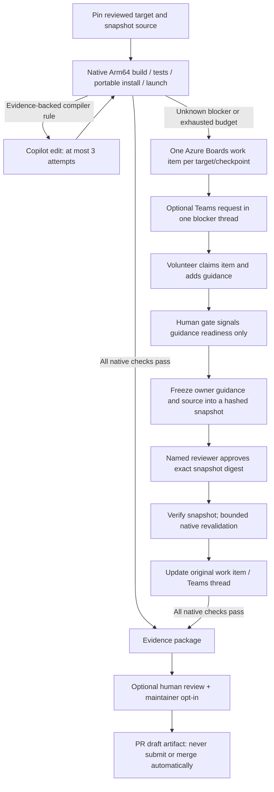

# OpenArm Azure DevOps flow

A queue-only Azure Pipelines prototype for agent-generated Windows Arm64 porting.
It includes a small runnable C++ application, actual native validation, bounded
Copilot CLI remediation, an Azure Boards volunteer gate, optional Teams delivery,
and human-reviewed contribution **drafts**. The separate repository CI entry point
runs offline checks and an x64 sample, without native workers or external actions.
Neither pipeline runs in Azure until you publish the repository and configure it.



## Run the pipeline

1. Put this workspace in a Git repository and create an Azure DevOps **YAML**
   pipeline pointing at `azure-pipelines.yml`.
2. Register a disposable **Windows Arm64** worker in the
   `OpenArm-Windows-ARM64` pool (or select another pool when queuing). Install
   PowerShell 7, Git, CMake/CTest, and Visual Studio Build Tools with the ARM64
   C++ toolchain and Windows SDK. Put native executables on PATH. Add the agent
   capability `OpenArm.NativeArm64=true`. This capability is only scheduling:
   the script independently verifies the actual OS architecture.
3. Create the **openarm-coordination** environment and authorize this pipeline
   to use it. Azure resolves referenced deployment resources even when their
   stages will be skipped. Before enabling handoff, add the exclusive-lock check
   described below; no deployments or notifications run with handoff disabled.
4. Use Visual Studio 2022 for the default target. For VS 2026, set the reviewed
   target's generator to `Visual Studio 18 2026` and use a compatible CMake.
5. Queue with defaults to build `samples\arm64-smoke`. Agents, human handoff,
   Teams, and upstream drafting are off by default. A failed native check makes
   **Finish fail**, not a false-green build.

The native job allows 120 minutes total. Commands have individual timeouts and
agent calls have a ten-minute limit. Each initial/resumed phase permits at most
`maxAttempts` agent calls (0-3); at most one human resume occurs in a run. A second
blocker requires a new explicitly queued run, not an endless approval loop.

### Check the native worker before registration

On the disposable worker, run PowerShell 7.2 or newer as the account that will run
the Azure agent:

```powershell
.\scripts\Test-NativeWorker.ps1
# For a reviewed VS 2026 target, and only if agent remediation will be enabled:
.\scripts\Test-NativeWorker.ps1 -Generator 'Visual Studio 18 2026' -RequireCopilot
```

This reads OS/process architecture, executable versions, CMake generator support,
the matching Visual Studio ARM64 C++ component, and Windows SDK ARM64 libraries
and headers. It writes `out\worker-...\worker.json` and logs; missing prerequisites
cause a failing exit. A configured `-CMake` executable that is found but cannot
start is also a prerequisite blocker: `worker.json` records its path, a null
exit code (no process ran), and the actual launch error, with `versionLog` pointing
to `cmake-version.log`. Independent Git, Visual Studio and Windows SDK findings
are retained, including `visual-studio.json` when vswhere runs; CTest and CMake
capabilities probes are skipped when CMake cannot start. Blocked inventories keep
`inventoryReady=false` and a `failure.log` summary. Choose a new `-Output` directory
for each run; existing output is never overwritten.
It installs nothing and does not register an agent or access
Azure. `inventoryReady` is only an inventory result: the native pipeline must still
prove configure, build, nonempty tests, package architecture, launch and timings.
Use the same generator as the reviewed target and make CMake/CTest available on
the agent account's PATH. Never add a capability to disguise an x64 host.

`Test-NativeWorker.ps1` and `Test-Project.ps1` resolve relative `-Output` paths
against the caller's PowerShell filesystem location and reject non-filesystem or
ambiguous Windows paths. Their optional `-OutputRoot` requires a strict descendant
of that existing root and rejects existing symlinks/junctions in the output
ancestry before creating artifacts.
For reviewed local candidate copies, use `Test-LocalCandidate.ps1` to supply
absolute output paths and an explicit child working directory. See
[the v2 local-validation protocol](CONTRIBUTING.md#producing-real-agent-task-evidence)
for its invocation and limitations. These checks are not an OS sandbox.

Reimage the worker between jobs. Keep the agent account unprivileged, restrict
outbound access to required services, and do not reuse a credential-bearing worker
for untrusted pull requests. Pool permissions, network isolation, project-scoped
tokens, resource checks and the coordination lock must be configured outside YAML;
this preflight does not audit or establish them.

### Select a real target

Add a reviewed JSON file under `targets` and queue with its `targetConfig` path:

```json
{
  "id": "your-app",
  "repository": "https://github.com/OWNER/REPOSITORY",
  "commit": "REPLACE_WITH_A_FULL_40_CHARACTER_COMMIT_SHA",
  "sourceSubdirectory": ".",
  "generator": "Visual Studio 17 2022",
  "executable": "bin\\your-app.exe",
  "smokeArguments": ["--self-test"],
  "performanceSamples": 5
}
```

The first adapter supports public GitHub repositories with CMake, CTest, a CMake
install target, and a deterministic command-line smoke workflow. It fetches an
immutable commit; it does not execute discovery results, follow branches,
initialize submodules, or guess build commands. `repository: self` uses the
pipeline checkout. Source snapshots with junctions/symlinks are rejected.

This is the engineering flow, **not yet automatic ecosystem discovery or the
compatibility dashboard**. Packaging formats and GUI applications need their own
reviewed adapters and target-specific workflow evidence.

## Enable Copilot remediation

Install the native GitHub Copilot CLI executable on the worker. An npm `.cmd`
shim is not supported by the process runner. Configure secret pipeline variable
`OpenArm.CopilotToken` with an appropriately scoped credential allowed to use
Copilot for the selected repository, then queue with `enableAgent: true`.
CLI authentication and availability depend on your organization's Copilot policy.

Only explicit compiler/architecture diagnostics are initially AI-actionable.
Other failures go to human input. Each classification includes the matching
reason and original log; it is a conservative rule, not a permanent judgment
about AI capability. The CLI receives the failure evidence and volunteer
guidance, may read/edit source, and is denied shell execution. Built-in MCPs are
disabled. Prompts and logs are artifacts. Azure DevOps runs the builds afterward.

**Trust boundary:** execute only reviewed, trusted target commits on disposable,
network-restricted workers, never on a developer desktop or a shared privileged
agent. Copilot permissions and stripped child-process environment variables are
defense in depth, **not a sandbox**; source/build code runs as the worker user.
Do not enable the credential-bearing agent mode for untrusted code. Never put
Azure Boards/Teams credentials, signing keys, or broad cloud credentials on
native workers. Protect pipeline/config changes and the agent pool with Azure
DevOps resource checks. Upstream source text and logs cannot authorize actions.

## Volunteer handoff and resume

Before queuing with `enableHumanHandoff: true`:

- Create environment **openarm-coordination**, add an **Exclusive lock** check,
  and restrict its pipeline permissions. Both coordinator stages use
  `lockBehavior: sequential`. This serializes work-item lookup/create and
  notification persistence across runs. YAML alone cannot create the check.
- Grant this project's Build Service identity only the Azure Boards permissions
  needed to view/create/update work items and comments. Coordinator tasks map
  `System.AccessToken`; native tasks do not. Use project-scoped job authorization.
- Set `approvers` to named users or a project group. Gates reject on timeout and
  disallow self-approval. The default work item type is **Issue**; for another
  project process, set pipeline variable `OPENARM_WORK_ITEM_TYPE` (for example
  `Impediment`). No custom fields are required.

Handoff writes a build-summary link to the Azure Boards item. A volunteer claims
**Assigned To** and posts a fresh comment:

```text
OPENARM_GUIDANCE: The native compiler component is now installed. Retry the build.
```

For an external GitHub target, an agent-generated fix can be selected explicitly
in that same comment:

```text
OPENARM_GUIDANCE: An agent fixed the architecture-specific source path. Please validate.
OPENARM_COMMIT: REPLACE_WITH_THE_AGENT_GENERATED_40_CHARACTER_COMMIT_SHA
```

An authorized human then resumes **Human**, which signals readiness only and does
**not authorize execution**. **ResumeInput** requires actionable guidance newer
than this run's blocker timestamp, authored and last edited by the claimed owner.
It restores the **post-attempt** source, preserves the original baseline and
attempt history, and optionally fetches the specified commit from the same
repository. Self targets require a newly queued run to select a different commit.

Before execution, **ResumeInput** publishes `openarm-resume-input`: source,
baseline, config, context, `guidance.txt`, and `approval.json`. The manifest binds
every file's SHA-256 plus the build ID, owner, work item, guidance comment/version
and source commit. The separate **ResumeApproval** gate displays the trusted
manifest digest and identifiers. Review that artifact, not a later live comment.
Approving authorizes only those exact bytes for that build. **NativeResume** checks
the trusted digest, complete file set, file hashes and build ID before consuming
the snapshot. Missing approval, substitution, tampering and cross-run replay fail
closed. No live guidance or commit is reread after approval. To change the input,
reject and queue a new run for a fresh snapshot and approval.

Resume does not rediscover the target or create another blocker request. On a
fresh worker it reruns prerequisite configure/build/test steps to reconstruct
the blocked checkpoint safely; CMake caches cannot be moved between workers.
`resumedFrom` records the original checkpoint. Validation updates the original
item's OpenArm status tags and reports in the original Teams thread. Volunteers
retain ownership of **Assigned To** and **State**; the pipeline never auto-closes
their work item.

## Optional Teams bridge

Teams is **off by default**. Without it, `teams-request.json` is still published,
and Azure Boards plus the agentless manual gate form a working handoff.

For live Teams, configure an HTTPS Logic App (or equivalent) using your
organization's authenticated **Microsoft Teams connector**, then store its
HTTP-trigger URL as secret `OpenArm.TeamsBridgeUrl` and set `enableTeams: true`.
The bridge is an external integration you must configure; no tenant resources,
connector consent, or channel are silently provisioned by this repository.

The HTTP contract is:

```json
{
  "action": "create",
  "messageKey": "blocker-key:build-id:Blocked",
  "blockerKey": "stable-repository-target-checkpoint-hash",
  "threadId": null,
  "workItemUrl": "https://dev.azure.com/ORG/PROJECT/_workitems/edit/123",
  "evidenceUrl": "https://dev.azure.com/ORG/PROJECT/_build/results?buildId=456&view=artifacts",
  "title": "OpenArm: target - needs_human",
  "analysis": "Evidence-backed blocker explanation",
  "checkpoint": "build",
  "expertise": "Windows Arm64 / CMake / dependency maintainers",
  "priorAttempts": [],
  "helpNeeded": "Claim the linked work item and provide guidance."
}
```

Configure the Logic App to accept this JSON, branch on `action`, use **Post
message in a chat or channel** for `create`, or **Reply with a message in a
channel** for `reply` using `threadId`, and return HTTP 200 JSON:

```json
{
  "threadId": "ROOT_CHANNEL_MESSAGE_ID",
  "threadUrl": "https://teams.microsoft.com/l/message/..."
}
```

The channel/team are fixed in the bridge, not supplied by arbitrary source code.
Post only the actionable summary, work-item link and evidence links, not raw build
logs. Return the **root** message ID even for replies. Protect the endpoint and
its run history; its SAS URL is a secret. Do not substitute a fire-and-forget
incoming webhook: the pipeline needs the root thread ID.

Azure Boards comments persist `OPENARM_TEAMS_PENDING` before sending and
`OPENARM_TEAMS_SENT` after acknowledgement. Confirmed requests are not resent.
If sending succeeds but acknowledgement is lost, the next attempt **fails
closed**, rather than potentially creating a duplicate root/thread reply.
Inspect the bridge's history and reconcile the original pending message by
adding a confirmed marker with its exact `messageKey`, `threadId`, and `threadUrl`:

```text
OPENARM_TEAMS_SENT: {"messageKey":"EXACT_PENDING_KEY","threadId":"ROOT_ID","threadUrl":"https://teams.microsoft.com/l/message/..."}
```

Never mark an undelivered request as delivered. For a proven failed send, an
operator must deliver/reconcile it explicitly. Work items over 200 comments
stop for coordination-state reconciliation instead of risking duplicate posts.
This favors no spam over automatic retries; it is not distributed exactly-once
delivery. Normal app-only Graph channel posting is not used: that API documents
application permissions for migration, not ordinary volunteer notifications.

## Evidence and upstream review

Artifacts include the source snapshot, original baseline, exact input commit,
blocker classification, prior attempts, command logs, installed portable package,
binary hashes, OS and PE architecture, CTest results, and raw launch/smoke timings.
`nativeVerified` becomes true only after all native gates pass. **No simulated
success or x64 cross-build is accepted.** Timings exclude one warmup run and
include process startup and the selected workflow. No x64 baseline or relative
speedup is invented.

The adapter verifies portable `cmake --install` output, not MSI/MSIX signing,
interactive GUI behavior, all transitive/system DLLs, or arbitrary core workflows.
Inspect source changes and add appropriate target-specific tests before making
a broader application-support claim.

Queue with `prepareUpstreamDraft: true` only after maintainer opt-in. A separate
human gate reviews evidence before publishing `pull-request-draft.md`,
`changes.patch`, and `result.json`. The draft requires a link to that consent.
An authorized human submits any upstream PR; nothing pushes, posts a PR, merges,
or claims that the sample build is a real ecosystem port.

## Repository CI and local checks

Create a **separate** Azure pipeline pointing at `azure-pipelines-ci.yml`. Its
hosted Windows job runs PowerShell behavior checks, strict YAML wiring checks,
and a fresh x64 sample configure/build/nonempty CTest/portable install/launch.
It publishes `repository-validation` JSON and logs even on failure. It has no
native-pool jobs, approval gates, variable groups or mapped Boards/Teams/Copilot
credentials. Do not grant PR builds secrets or access to protected native pools.

YAML `pr` triggers apply to GitHub/Bitbucket repositories. For **Azure Repos**, set
a required, automatic **Build validation** branch policy on `main` selecting this
CI pipeline; YAML alone does not enable PR validation there. Require an independent
human reviewer, reset approvals when source changes, and prevent direct pushes or
policy bypass for ordinary contributors. For GitHub, require the actual reported
CI status and a reviewer through branch protection/rulesets. These controls need
repository-admin setup; adding YAML does not establish enforcement.

Run the same command locally with Windows, PowerShell 7.2+, Python 3.12, and Visual
Studio C++/Windows SDK installed:

```powershell
.\scripts\Test-Project.ps1
# Override tool discovery for a local VS 2026 installation:
.\scripts\Test-Project.ps1 -Generator 'Visual Studio 18 2026' -CMake 'C:\path\to\cmake.exe'
# The smallest behavior-only check needs neither Python nor the C++ toolchain:
.\tests\Test-OpenArm.ps1
```

The shared runner installs pinned PyYAML into `.local\python` only if it is missing,
never globally. Each invocation uses a new `out\ci-...` directory with source hashes,
step exit codes and logs. Use `-Output` to choose another **new** directory; old
evidence is never overwritten. Checks cover coordination mocks and failure paths,
not a live Azure run. x64 CI success is not native verification or evidence of an
agent completing a task. See [CONTRIBUTING.md](CONTRIBUTING.md) for review and real
agent-evidence requirements. Reusable porting instructions live in `.github\agents`
and `.github\skills`.

References: [manual validation](https://learn.microsoft.com/en-us/azure/devops/pipelines/tasks/reference/manual-validation-v1?view=azure-pipelines),
[resource checks and locking](https://learn.microsoft.com/en-us/azure/devops/pipelines/process/approvals?view=azure-devops),
[cross-stage output expressions](https://learn.microsoft.com/en-us/azure/devops/pipelines/process/expressions?view=azure-devops),
[Azure Repos build validation](https://learn.microsoft.com/en-us/azure/devops/repos/git/branch-policies?view=azure-devops&tabs=browser#build-validation),
[Teams Graph send permissions](https://learn.microsoft.com/en-us/graph/api/channel-post-messages?view=graph-rest-1.0).
