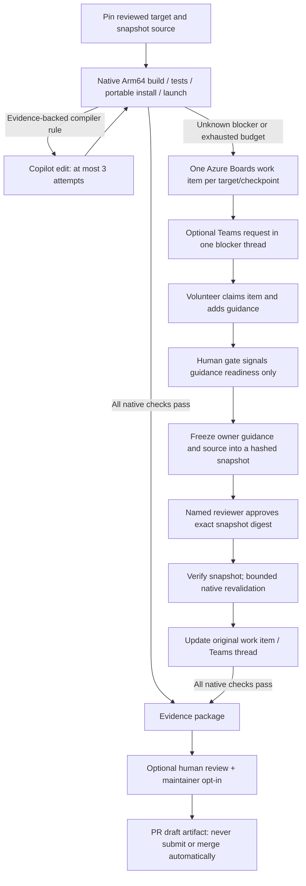

# OpenArm

**Porting goal: native Windows Arm64 support, not x64/x86 emulation.** Repairs must
produce genuine Arm64 application binaries and runtime dependencies, pass native
tests, and run the installed application's declared core workflow. Selecting or
renaming an x64 executable, improving emulation fallback, or passing version/help
probes does not meet this goal. Missing native dependencies or validation adapters
remain explicit human blockers, not compatibility-success results.

Use the manual GitHub Actions workflow to discover Trending and Foundational repositories with
reported Windows Arm64 work or create a documentation-only draft PR inside your
fork. This read-only discovery/API fork trial uses GitHub's hosted Windows Arm64 runner and installs
native Copilot CLI; it needs no Azure DevOps setup or self-hosted worker.

The separate **Copilot diagnosis and reviewed repair** workflow makes actual AI
requests. It defaults to diagnosis of the Hermes browser report, not an invented
port. Reviewed CMake targets can use a bounded edit, independent native validation
and opt-in draft-PR publisher. See [Copilot setup](#run-copilot-diagnosis-and-reviewed-repairs).

The separate native-porting prototype still uses queue-only Azure Pipelines.
It includes a small runnable C++ application, actual native validation, bounded
Copilot CLI remediation, an Azure Boards volunteer gate, optional Teams delivery,
and human-reviewed contribution **drafts**. The separate repository CI entry point
runs offline checks and an x64 sample, without native workers or external actions.
Those native/CI pipelines run in Azure only after you publish the repository and
configure them; the GitHub Actions trial does not replace their native validation
or Azure Boards/Teams approval flow.



## Discover Trending and Foundational repositories

Publish `.github\workflows\github-trial.yml` and the referenced scripts to your
OpenArm repository's **default branch**. Enable GitHub Actions if repository policy
permits, then open **Actions > GitHub discovery and fork trial > Run workflow**.
Select only a trusted branch/revision: it will run with any configured trial
secret. The workflow has no push/PR trigger. Its trial job uses the hosted
**`windows-11-arm`** runner and verifies that both the OS and PowerShell process
are Arm64. No self-hosted Arm64 worker, Azure Boards or Teams setup is needed.
The independent issue-notification job remains on `windows-latest` (x64), since
it only calls the GitHub Issues API.
The old Azure trial pipeline file has been replaced, not retained as a second
entry point. The native Azure pipeline and repository CI are unchanged.

Before discovery or the fork trial, a pinned setup action selects **Node.js 24
Arm64**, then installs **`@github/copilot@1.0.85`**. The workflow resolves the
package's native Windows Arm64 executable, verifies PE machine **`0xAA64`**, runs
`--version`, records its SHA-256 in the job log, and adds its directory to PATH.
Any setup/architecture/version failure stops the trial and can trigger the
human-help issue job. See the [official runner image](https://github.com/actions/runner-images/blob/main/images/windows/Windows11-Arm64-Readme.md)
and [Copilot CLI installation documentation](https://github.com/github/copilot-cli#installation).

**Installing the CLI does not invoke AI.** This workflow does not send a prompt,
request Copilot permissions, consume Copilot requests or claim to repair a
target. Actual AI repair still needs an explicit task, Copilot entitlement and a
reviewed target/build-validation path. Selecting an Arm64 runner and checking the
CLI are not proof of the target application's native compatibility.

Run with **`sourceRepositoryUrl` blank** and **`createForkPullRequest` unchecked**.
**`createHumanHelpIssue` is checked by default**: the workflow creates an issue
in the OpenArm repository when discovery needs review or a run fails. Uncheck it
for a strictly read-only discovery run; the discovery script uses REST GETs and
one GraphQL query POST, never mutations or target repository writes.
Set **`discoveryTrack`** to **`both`** (the default), `trending`, or `foundational`.
Trending takes the first ten repositories displayed on
[GitHub's weekly Trending page](https://github.com/trending?since=weekly), retaining
the displayed rank and reported weekly-star count. It does not equate lifetime
stars with recent growth or independently reconstruct star histories.
Foundational takes up to ten entries from the reviewed
`targets\discovery\foundational.json` catalog: runtimes, toolchains and shared
libraries, with a category and explicit rationale for each. Catalog order is a
curated priority, not a measured dependency ranking or proof of a native gap.
There is **no minimum lifetime-star threshold**.

The tracks are ranked separately and each can recommend one provisional candidate
with an explicit native support request or failure report. Overlapping repositories
are assessed once and retain both source ranks; if both tracks recommend the same
repository, that is one repair candidate, not two separate porting tasks.
All selected repositories must be public, non-archived and non-forks. The scan
checks bounded issue evidence and latest stable GitHub release assets. Download the
`github-trial-<run-id>-<attempt>` artifact from the workflow run:
**`discovery.md`** contains both source rankings, rationales, issue links and binary
evidence. **`discovery.json`** is now **schema version 3**: `sources` records source
provenance and HTML/catalog hashes; `recommendations` is an array with at most one
entry per track, replacing the old singular `recommendation`. Assessments, request
outcomes, timestamps, inspection limits and failures remain explicit.

Optionally add **`OPENARM_GITHUB_DISCOVERY_TOKEN`** under **Settings > Secrets and
variables > Actions > New repository secret**, using a token issued for
**GitHub.com** with public read access only; no write
permissions are needed. Without it, **GitHub Actions uses its existing read-only
job token** for public discovery, avoiding reliance on the shared runner's
anonymous quota. The token is passed only to API reads in the discovery step;
Trending and release asset downloads remain anonymous. Local runs without this environment variable still
use anonymous public REST reads, but cannot recommend candidates because the
linked-upstream-fix check requires GraphQL authentication.
It never reuses `OPENARM_GITHUB_TOKEN` (which may belong to `msft.ghe.com`).
Searches are spaced 3 seconds apart with a token or 7 seconds anonymously
(GitHub search limits: 30 or 10 requests/minute respectively). Shared-IP limits
can still apply. HTTP errors, rate limits and incomplete responses fail visibly,
retain partial reports and make **no recommendation**; requests are not retried.

The bounded scan makes **at most 60 API GET requests**: repository metadata, one
issue search and one latest-release read for each of at most twenty unique
repositories. The issue query remains `repo:OWNER/REPO is:issue is:open Windows
ARM64 in:title,body`, inspecting up to five most recently updated matches.
After issue and release reads complete, **one authenticated GraphQL query POST**
checks `closedByPullRequestsReferences` for every title-eligible issue (at most
100 issues), with up to ten linked PRs per issue and explicit pagination limits.
No GraphQL mutation is used; no eligible issues means no GraphQL request.
A latest-release 404 records `no_published_release`, not absent support.
The Trending source adds one anonymous HTML GET, limited to **2 MiB and 30 seconds**
with no redirects, cookies or credentials. Changed/malformed markup, missing weekly
counts or source failures stop the scan visibly; it never falls back to a
lifetime-star ranking. A single-track run avoids fetching the other source.
The core API has a separate anonymous limit (normally 60 requests/hour, shared by IP).
No language filter is applied. GitHub metadata and search are not a consistent
global snapshot; documentation repositories and inapplicable issue matches may remain.

Assessments are `reported_arm64_work`, `needs_review` or
`no_matching_open_issue` (plus `not_assessed`/`error` on interrupted scans).
Matching totals and the five-title limit are explicit. **A recommendation is
provisional, not proof that the repository lacks Arm64 support.** Existing support
can have open bugs. Missing matches or documentation prove nothing; aliases,
non-English reports, closed issues and older matches may be missed. A complete
scan may honestly find no candidate. Review the linked report and reproduce it
on native Windows Arm64 before choosing build commands or writing a port.

Each issue's `upstreamFixReview` records linked PR URLs, repositories, states and
truncation. **An open or merged linked closing PR excludes that issue**, including
a fix in another owning repository. Closed, unmerged PRs alone do not exclude it.
The selector continues to the next eligible issue/repository in each source order.
Missing authentication (`unverified_no_auth`) or a truncated connection without a
known active fix (`unverified_truncated`) cannot establish eligibility. API,
GraphQL or malformed/partial-response errors fail the scan with no recommendations.
`no_active_linked_fix` means only that no open/merged fix was found in the complete
bounded connection, not that no fix exists anywhere: unlinked PRs, issue comments
and dependency ownership still need human review. A known linked fix is skipped
even when further links exceed the ten-PR limit.

Release evidence records the tag, publication time, release URL and up to **100
assets from the latest-release response** (names, URLs and sizes). Drafts,
prereleases, older releases and distribution through npm, PyPI, vendors or other
channels are outside this scope. Filename platform/architecture hints are
**advertised, not verified**. Discovery downloads at most **3 assets per
repository**, preferring Windows Arm64 names, then other Windows assets:

- Direct `.exe`/`.dll`: inspect at most **64 KiB** using a range request (also
  bounded if the server ignores the range), reading the actual PE machine field.
- `.zip` up to **16 MiB**: inspect in memory without extracting any paths.
  At most **512 entries** are considered and **16 EXE/DLL prefixes** are read,
  with at most **64 KiB decompressed per prefix**. Non-Windows-labelled archives
  are skipped; unlabelled ZIPs can reveal otherwise unadvertised PE binaries.
- Downloads use **no credentials or cookies**, only HTTPS GitHub release URLs
  and allowlisted GitHub release CDN hosts, with at most **3 redirects**,
  **30 seconds per asset**, **128 MiB total** and a **180-second release-phase
  budget**. Metadata still gets checked after the download budget expires.
  Downloaded bytes stay in memory; only sample sizes, SHA-256 digests, PE
  evidence and sanitized errors are retained. Download failures fail the scan
  explicitly with partial evidence and no recommendation.

`release.windowsArm64` distinguishes `pe_header_found`,
`advertised_unverified`, `x64_observed_arm64_not_found_in_sample` and `unknown`.
ARM64, ARM64EC and ARM64X machine types are recorded separately. Empty assets,
invalid PE/ZIP data and filename/header mismatches are flagged; oversized
archives, unsupported formats (including MSI/MSIX), large PE header offsets and
budget limits remain explicitly unverified. These are header observations, not
signature/integrity checks, proof that every component is Arm64, or a successful
application launch. An x86 PE header may also belong to managed AnyCPU code.

Each recommendation still requires an inspected matching issue and preserves
its own source order. Its `workKind` directs review toward an artifact problem, an
existing advertised/observed Arm64 distribution, a possible distribution gap,
or an unresolved issue with unknown release evidence. Existing Arm64 binaries
do not suppress a real reported bug; x64-only observations in this bounded
sample do not establish that an entire repository lacks Arm64 support.
Before selecting a repair, check existing fixes and identify the repository that
owns the blocker. If several applications are blocked by one native dependency,
repair that dependency once. Emulation-only reports require review, not an
automatic fix. A reproducible native gap, reviewed build/validation adapter and
genuine Arm64 runtime/core-workflow evidence are required before a repair draft.

Discovery never clones or executes target code, forks a repository, creates a PR
or generates an unreviewed native target configuration. A blank URL with
`createForkPullRequest: true` is rejected. A real source repair uses a separately
reviewed task in the [Copilot repair workflow](#run-copilot-diagnosis-and-reviewed-repairs).
The URL-based documentation-only trial below is not an Arm64 implementation.

Local read-only equivalent: `.\scripts\Find-Arm64Candidate.ps1`.
Use `-Track trending` or `-Track foundational` to select one source locally.
Set `OPENARM_GITHUB_DISCOVERY_TOKEN` only if authenticated public reads are needed;
`-Output` selects a new report directory and optional `-OutputRoot` bounds it.
The default output is a unique `out\discovery-*` directory.

### Reproduce the next native candidate before repairing

The manual **Native NumPy inverse reproduction** workflow tests
[NumPy #29442](https://github.com/numpy/numpy/issues/29442) on `windows-11-arm`,
using the report's native Python **3.12.10** and separate jobs for the reported
**2.3.2** wheel and current **2.5.3** wheel. `targets\numpy-repro\*.txt` pins the
exact PyPI `cp312-cp312-win_arm64` wheel hashes. It does not edit NumPy, call an
AI agent, create a fork/PR or consume a publishing secret.

`scripts\numpy_reproduction.py` checks the native OS/process and PE headers/hashes
of the installed Python/NumPy runtime EXE, DLL and PYD files, then exercises the
issue's seed, 20-by-20 matrix, complex64/complex128 and symmetric/hermitian inputs.
Float32/float64 controls are included. Two child processes run at a time, each
performing 100 inversions and checking the inverse residual, with a 120-second
per-case limit. An access-violation exit code is distinguished from numerical
failure, setup failure, timeout and missing completion evidence.

Download both `numpy-reproduction-<version>-<run-id>-<attempt>` artifacts, including
failed jobs. They contain the install log, runtime binary inventory, per-case logs
and `cases\result.json`. This is **wheel reproduction, not a native source repair**.
A passing current wheel does not prove that older wheels or other workflows work;
an old-only failure is not a reason to invent a new source fix. A reproduced
current failure still needs dependency ownership and a reviewed source-build
adapter before the Copilot repair workflow can generate a genuine native draft.

The [native trial on September 17, 2026](https://github.com/sykuang/OpenArm/actions/runs/35211701652)
installed both pinned wheels but stopped **before running the inverse cases**:
the Python 3.12.10 Arm64 toolcache package contains `vcruntime140_1.dll` with PE
machine **0x8664**, while the other 65 inventoried Python/NumPy binaries are
**0xAA64**. The strict package gate remains unchanged. This is a runtime-package
inventory blocker, not a reproduced NumPy crash or evidence that the Python
process used emulation. No NumPy fix or native draft PR resulted from this trial.
REST reference: [search syntax, scope, incomplete results and rate limits](https://docs.github.com/en/rest/search/search).
Release references: [latest published release](https://docs.github.com/en/rest/releases/releases#get-the-latest-release)
and [release asset downloads](https://docs.github.com/en/rest/releases/assets#get-a-release-asset).
Actions reference: [running a manual workflow](https://docs.github.com/en/actions/how-tos/manage-workflow-runs/manually-run-a-workflow).

## Run Copilot diagnosis and reviewed repairs

Publish `.github\workflows\copilot-repair.yml`, its scripts and the reviewed
`targets\github` manifests on your trusted default branch. Open **Actions >
Copilot diagnosis and reviewed repair > Run workflow**. The original discovery
and documentation-only fork trial remains unchanged.

The **agent job alone** grants `contents: read` and `copilot-requests: write`,
then passes the built-in `GITHUB_TOKEN` only to the Copilot step. No additional
Copilot PAT is normally needed. The repository owner's Copilot entitlement,
allowance, billing and applicable policies must permit Actions requests. Each
run makes one exact-response authentication request; a diagnostic or repair
requires at most one additional CLI invocation. Each invocation times out after
10 minutes and is not retried. This bounds attempts and elapsed time, **not
credits**: an editing invocation may make multiple model requests. No model or
subscription setting is changed. See the
[official Copilot Actions guide](https://docs.github.com/en/copilot/how-tos/copilot-cli/use-copilot-cli-in-actions).

**Default task: `hermes-browser-77488`.** This sends actual Copilot requests with
reviewed issue context and selected source files from Hermes commit
`682a95258ce9e877cfb607a5ada6436183efdebb`. It is deliberately **diagnosis-only**:
the report concerns an external `agent-browser` npm binary, and
[PR #77093](https://github.com/NousResearch/hermes-agent/pull/77093) was already
open when the task was reviewed. The adapter does not download or execute that
npm package, reproduce the browser failure, claim a native port, edit Hermes or
create a PR, even if `publishDraft` is selected. Its expected result is
`needs_human` with `authVerified: true` and a Copilot analysis. Review the existing
PR and reproduce the exact package/browser behavior on Windows Arm64 before
registering an appropriate repair adapter. An API report, title or successful
`--version` is not that reproduction.

**Native pipeline self-test: `cmake-smoke`.** This builds the existing sample
with CMake/CTest, installs it, checks every installed EXE/DLL for Arm64 PE machine
`0xAA64`, and launches its smoke command on `windows-11-arm`. A passing baseline
returns `already_validated`; no unnecessary AI edit or PR is made. The Copilot
authentication probe still runs. A self target never publishes externally.

For a real **CMake** repair, add and review a tracked
`targets\github\<task-id>.json` manifest before dispatch. Use the CMake fields
from `cmake-smoke.json`, set `repository` to a public GitHub HTTPS URL and `commit`
to a full immutable SHA, and supply the specific `issue`, `context`, and distinct
`fork` (`OWNER/REPO`). `allowedFiles` permits at most five existing C/C++ source
files or `CMakeLists.txt`, relative to `sourceSubdirectory`; tests, workflow files,
arbitrary scripts, deletions and new files are not supported. Changes are limited
to 64 KiB per UTF-8 file and 128 KiB total. The configured generator, build and
smoke commands must be appropriate for that reviewed target. This is not a
universal porting adapter; Python/npm projects need their own reviewed validation.

**Retired emulation repair: `agent-browser-empty-launcher`.** This task ID is now
**diagnosis-only** with no editable files. The x64-fallback adapter has been removed;
existing compatibility artifacts and draft PRs are historical, not native-porting
evidence. Future agent-browser repair requires a reviewed native build/packaging
adapter, Arm64 runtime dependencies, nonempty tests and an actual installed browser
workflow. Until then, diagnosis returns `needs_human`; neither an edit nor a PR is
allowed, even with `publishDraft: true`.

The jobs deliberately separate capabilities:

- **Prepare:** fetch the pinned target and reproduce the native baseline without
  either Copilot or publishing credentials. Only classified compiler/architecture
  failures permit remediation; access problems and unknown failures need a human.
- **Agent:** first verify actual AI access with no tools, then allow one edit of
  the selected source files using file tools and absolute-path write permissions.
  Shell, URL access, built-in MCP servers and custom repository
  instructions are disabled; default path checks stay on. No unrestricted
  `--yolo`, arbitrary validation commands or publishing token is provided.
- **Validate:** on a fresh Arm64 runner, re-fetch the pinned source, reproduce the
  baseline, check candidate identity/path/content hashes, and re-run the full
  configured native validation. AI success alone never authorizes publication.
- **Publish:** only after independent validation and `publishDraft: true`, use
  `OPENARM_GITHUB_TOKEN` in a separate API-only job. The exact candidate is bound
  to the task, workflow commit and run. The existing fork must match the source
  network, have no active Actions workflows, and have its default branch still
  at the pinned base. No fork creation, sync, reset, force push, upstream PR or
  merge occurs. A rerun refuses an existing repair branch; ambiguous writes are
  journaled and never retried automatically.

For publishing, use the fine-grained fork-only token described below (Contents
and Pull requests write; Actions read). Keep the fork free of secrets and
external automation. Copilot permission controls and environment scrubbing are
**not an OS sandbox**. Reviewed target code and generated changes execute only on
disposable hosted runners, not in the publisher; inspect the draft diff and logs
before trusting or merging it. The publisher does not audit third-party webhooks
or grant additional permissions. Protect workflow/manifest changes with your
normal repository review controls.

Download `repair-prepared-*`, `repair-agent-*`, `repair-validated-*` and, when
applicable, `repair-published-*` artifacts for `report.json`, `auth.log`,
`copilot.log`, candidate content and native logs/mutation receipts. They are
run-and-attempt scoped and retained for seven days, including failures. A
successful diagnostic job with `needs_human` means the analysis completed, **not
that the issue was fixed**. Authentication errors, unreproduced failures, no
eligible changes, failed native checks or publication guards produce no PR;
inspect the artifact and job summary. This workflow does not automatically
create a human-help issue or resume from comments.

`tests\Test-CopilotRepair.ps1` covers credential filtering, bounded CLI arguments,
candidate validation and the publisher's REST behavior with offline doubles.
Repository CI never calls Copilot or writes to a real fork.

## Try GitHub repository checks, a fork, and a draft PR

Use the same Actions workflow with a **nonblank** `sourceRepositoryUrl` for the temporary
integration trial; this path does not run discovery.

1. Add **`OPENARM_GITHUB_TOKEN`** as an **Actions repository secret** in OpenArm.
   Use a personal access token issued by the same GitHub host as the source
   project, not the workflow's built-in `GITHUB_TOKEN`: that token is scoped to
   the workflow repository, not a personal account for creating forks.
   Never put the token in YAML, a repository URL, a workflow input or chat.
2. Run with `sourceRepositoryUrl` set to the original project you want to copy,
   such as `https://github.com/OWNER/PROJECT`. This is not necessarily OpenArm:
   OpenArm supplies the workflow; the selected project is its target. Supported
   hosts are `github.com` and `msft.ghe.com`; forks stay on the same host.
   `forkOwner` is optional: blank uses the token owner, or specify an organization
   where your account is allowed to create forks. Managed-user/enterprise policy
   may require an organization. The destination must differ from the source.
3. Initially leave **`createForkPullRequest: false`**. This checks authentication,
   source identity/default-branch commit, and any existing destination fork using
   GET requests only. Inspect `result.json` in the artifact; this is an access check,
   not a build, compatibility scan, or guarantee of all write permissions.
4. To perform the live trial, use **Run workflow** again with
   **`createForkPullRequest` checked**.
   It creates or reuses a matching fork, waits for its git objects, creates
   `openarm-trial-<repository-id>-<run-id>`, adds one documentation-only file under
   `openarm-trials`, and opens a **draft PR with both head and base in that fork**.
   The PR URL, commit, request outcomes and failures are saved in the artifact.

For a pre-existing destination fork, a fine-grained token needs **Contents: read
and write**, **Pull requests: read and write**, and **Actions: read**, plus source
read access. Scope it to the needed repositories; metadata access is implicit.
Creating a new fork also requires the host to permit forking into the destination,
and the token must be able to access the resulting repository. For least privilege,
pre-create a dedicated fork and select it in the token's repository access rather
than granting broad access just for this test. Missing access, SSO authorization
or enterprise fork restrictions produce a failing run, not a permission bypass.

The trial job grants its built-in token only `contents: read` for checkout and
public discovery, does
not persist checkout credentials, and passes each PAT only to its own API step.
Official checkout/upload actions are pinned to commit SHAs. The evidence upload
step runs even after failure, fails if no files exist, and retains artifacts for
7 days. Each rerun attempt has its own artifact name without replacing earlier
evidence. This workflow targets GitHub.com/GitHub Enterprise Cloud; its artifact
action is not compatible with GitHub Enterprise Server.
The separate human-help job uses its own built-in token with only `issues: write`,
without checkout or either PAT.

The trial uses GitHub REST APIs; the Actions job does **not** clone or execute the
target's code. Use a dedicated test fork with no secrets or external automation.
Before branch/commit/PR writes, the script checks that the destination has no
active GitHub Actions workflows; incomplete inventory or an unknown state is an
error. It does not disable workflows, alter permissions or audit third-party
webhooks/integrations. Fork initialization is polled for up to 30 observations;
mutating API calls are never automatically retried after ambiguous failures.

An existing same-name repository must belong to the expected fork network.
Existing trial branches are not overwritten. **Re-run jobs** keeps the same trial
ID and refuses an existing branch instead of creating another PR; a new manual
workflow dispatch gets a new trial ID. The fork's default branch is never synced,
reset, force-pushed or directly edited. There is no upstream PR, merge or automatic
cleanup. Close the test PR or remove its branch/fork manually when finished.
This trial is **not a native porting patch or agent-benchmark result**.

`tests\Test-GitHubTrial.ps1` exercises this flow with offline REST doubles and
synthetic credentials; `tests\Test-RepositoryDiscovery.ps1` covers read-only
discovery, ranking, evidence limits, partial failures and token separation.
Repository CI never uses real GitHub tokens or performs live discovery.
REST references: [forks](https://docs.github.com/en/rest/repos/forks),
[contents](https://docs.github.com/en/rest/repos/contents),
[pull requests](https://docs.github.com/en/rest/pulls/pulls), and
[data-resident API hosts](https://docs.github.com/en/enterprise-cloud@latest/rest/using-the-rest-api/getting-started-with-the-rest-api).

## Human help through GitHub issues

With **`createHumanHelpIssue: true`** (the default), the Actions workflow creates
an issue in **the repository hosting OpenArm**, currently
`https://github.com/sykuang/OpenArm`, when the trial job fails or discovery finishes
and a person must review/select a target. A successful manual access check or
fork/PR trial does not need an issue. Canceled/skipped runs do not create one.
This notification never posts an issue to a discovered target or its upstream.

The issue explains the kind of help needed and links to the workflow run,
including logs and per-attempt artifacts. It does not copy raw logs, tokens or
untrusted target content into the issue. The failed trial stays failed even if
notification succeeds. A successful discovery still needs human review: open
issue evidence is not a reproduced native Windows Arm64 failure.

No extra PAT is needed. Enable **Issues** on the OpenArm repository and permit
the workflow's built-in `GITHUB_TOKEN` to use `issues: write` in the reporting job.
Permission/API failures or disabled Issues make that job fail explicitly; the
trial job's evidence is independent. `createHumanHelpIssue: false` disables the
reporting job and is the opt-out for workflows that must perform no issue writes.

Reruns serialize reporting and reuse the same bot-authored issue using a hidden
run-ID marker, including closed issues; they do not overwrite the body, reopen it
or add duplicate comments. Keep the marker when editing the issue. A new manual
run can create a new issue. Lookup reads at most 1,000 bot-authored issues across
all states; if the inventory exceeds that bound, reporting fails rather than
risking a duplicate. Requests are not automatically retried. After an ambiguous
creation error, inspect existing issues before retrying.

**Comments and issue closure never execute instructions or resume work.** Review
the evidence, resolve access/configuration or select a reviewed target, then
start a new manual workflow run. This is notification for the GitHub trial, not
a replacement for the separate native Azure pipeline's approved-snapshot gates.
`tests\test_human_help.cjs`, run by `tests\test_pipeline.py`, exercises the actual
inline workflow script using an offline GitHub API double.

## Run the native pipeline

1. Put this workspace in a Git repository and create an Azure DevOps **YAML**
   pipeline pointing at `azure-pipelines.yml`.
2. Register a disposable **Windows Arm64** worker in the
   `OpenArm-Windows-ARM64` pool (or select another pool when queuing). Install
   PowerShell 7, Git, CMake/CTest, and Visual Studio Build Tools with the ARM64
   C++ toolchain and Windows SDK. Put native executables on PATH. Add the agent
   capability `OpenArm.NativeArm64=true`. This capability is only scheduling:
   the script independently verifies the actual OS architecture.
3. Create the **openarm-coordination** environment and authorize this pipeline
   to use it. Azure resolves referenced deployment resources even when their
   stages will be skipped. Before enabling handoff, add the exclusive-lock check
   described below; no deployments or notifications run with handoff disabled.
4. Use Visual Studio 2022 for the default target. For VS 2026, set the reviewed
   target's generator to `Visual Studio 18 2026` and use a compatible CMake.
5. Queue with defaults to build `samples\arm64-smoke`. Agents, human handoff,
   Teams, and upstream drafting are off by default. A failed native check makes
   **Finish fail**, not a false-green build.

The native job allows 120 minutes total. Commands have individual timeouts and
agent calls have a ten-minute limit. Each initial/resumed phase permits at most
`maxAttempts` agent calls (0-3); at most one human resume occurs in a run. A second
blocker requires a new explicitly queued run, not an endless approval loop.

### Check the native worker before registration

On the disposable worker, run PowerShell 7.2 or newer as the account that will run
the Azure agent:

```powershell
.\scripts\Test-NativeWorker.ps1
# For a reviewed VS 2026 target, and only if agent remediation will be enabled:
.\scripts\Test-NativeWorker.ps1 -Generator 'Visual Studio 18 2026' -RequireCopilot
```

This reads OS/process architecture, executable versions, CMake generator support,
the matching Visual Studio ARM64 C++ component, and Windows SDK ARM64 libraries
and headers. It writes `out\worker-...\worker.json` and logs; missing prerequisites
cause a failing exit. A configured `-CMake` executable that is found but cannot
start is also a prerequisite blocker: `worker.json` records its path, a null
exit code (no process ran), and the actual launch error, with `versionLog` pointing
to `cmake-version.log`. Independent Git, Visual Studio and Windows SDK findings
are retained, including `visual-studio.json` when vswhere runs; CTest and CMake
capabilities probes are skipped when CMake cannot start. Blocked inventories keep
`inventoryReady=false` and a `failure.log` summary. Choose a new `-Output` directory
for each run; existing output is never overwritten.
It installs nothing and does not register an agent or access
Azure. `inventoryReady` is only an inventory result: the native pipeline must still
prove configure, build, nonempty tests, package architecture, launch and timings.
Use the same generator as the reviewed target and make CMake/CTest available on
the agent account's PATH. Never add a capability to disguise an x64 host.

`Test-NativeWorker.ps1` and `Test-Project.ps1` resolve relative `-Output` paths
against the caller's PowerShell filesystem location and reject non-filesystem or
ambiguous Windows paths. Their optional `-OutputRoot` requires a strict descendant
of that existing root and rejects existing symlinks/junctions in the output
ancestry before creating artifacts.
For reviewed local candidate copies, use `Test-LocalCandidate.ps1` to supply
absolute output paths and an explicit child working directory. See
[the v2 local-validation protocol](CONTRIBUTING.md#producing-real-agent-task-evidence)
for its invocation and limitations. These checks are not an OS sandbox.

Reimage the worker between jobs. Keep the agent account unprivileged, restrict
outbound access to required services, and do not reuse a credential-bearing worker
for untrusted pull requests. Pool permissions, network isolation, project-scoped
tokens, resource checks and the coordination lock must be configured outside YAML;
this preflight does not audit or establish them.

### Select a real target

Add a reviewed JSON file under `targets` and queue with its `targetConfig` path:

```json
{
  "id": "your-app",
  "repository": "https://github.com/OWNER/REPOSITORY",
  "commit": "REPLACE_WITH_A_FULL_40_CHARACTER_COMMIT_SHA",
  "sourceSubdirectory": ".",
  "generator": "Visual Studio 17 2022",
  "executable": "bin\\your-app.exe",
  "smokeArguments": ["--self-test"],
  "performanceSamples": 5
}
```

The first adapter supports public GitHub repositories with CMake, CTest, a CMake
install target, and a deterministic command-line smoke workflow. It fetches an
immutable commit; it does not execute discovery results, follow branches,
initialize submodules, or guess build commands. `repository: self` uses the
pipeline checkout. Source snapshots with junctions/symlinks are rejected.

This is the engineering flow, **not yet automatic ecosystem discovery or the
compatibility dashboard**. Packaging formats and GUI applications need their own
reviewed adapters and target-specific workflow evidence.

## Enable Copilot remediation

Install the native GitHub Copilot CLI executable on the worker. An npm `.cmd`
shim is not supported by the process runner. Configure secret pipeline variable
`OpenArm.CopilotToken` with an appropriately scoped credential allowed to use
Copilot for the selected repository, then queue with `enableAgent: true`.
CLI authentication and availability depend on your organization's Copilot policy.

Only explicit compiler/architecture diagnostics are initially AI-actionable.
Other failures go to human input. Each classification includes the matching
reason and original log; it is a conservative rule, not a permanent judgment
about AI capability. The CLI receives the failure evidence and volunteer
guidance, may read/edit source, and is denied shell execution. Built-in MCPs are
disabled. Prompts and logs are artifacts. Azure DevOps runs the builds afterward.

**Trust boundary:** execute only reviewed, trusted target commits on disposable,
network-restricted workers, never on a developer desktop or a shared privileged
agent. Copilot permissions and stripped child-process environment variables are
defense in depth, **not a sandbox**; source/build code runs as the worker user.
Do not enable the credential-bearing agent mode for untrusted code. Never put
Azure Boards/Teams credentials, signing keys, or broad cloud credentials on
native workers. Protect pipeline/config changes and the agent pool with Azure
DevOps resource checks. Upstream source text and logs cannot authorize actions.

## Volunteer handoff and resume

Before queuing with `enableHumanHandoff: true`:

- Create environment **openarm-coordination**, add an **Exclusive lock** check,
  and restrict its pipeline permissions. Both coordinator stages use
  `lockBehavior: sequential`. This serializes work-item lookup/create and
  notification persistence across runs. YAML alone cannot create the check.
- Grant this project's Build Service identity only the Azure Boards permissions
  needed to view/create/update work items and comments. Coordinator tasks map
  `System.AccessToken`; native tasks do not. Use project-scoped job authorization.
- Set `approvers` to named users or a project group. Gates reject on timeout and
  disallow self-approval. The default work item type is **Issue**; for another
  project process, set pipeline variable `OPENARM_WORK_ITEM_TYPE` (for example
  `Impediment`). No custom fields are required.

Handoff writes a build-summary link to the Azure Boards item. A volunteer claims
**Assigned To** and posts a fresh comment:

```text
OPENARM_GUIDANCE: The native compiler component is now installed. Retry the build.
```

For an external GitHub target, an agent-generated fix can be selected explicitly
in that same comment:

```text
OPENARM_GUIDANCE: An agent fixed the architecture-specific source path. Please validate.
OPENARM_COMMIT: REPLACE_WITH_THE_AGENT_GENERATED_40_CHARACTER_COMMIT_SHA
```

An authorized human then resumes **Human**, which signals readiness only and does
**not authorize execution**. **ResumeInput** requires actionable guidance newer
than this run's blocker timestamp, authored and last edited by the claimed owner.
It restores the **post-attempt** source, preserves the original baseline and
attempt history, and optionally fetches the specified commit from the same
repository. Self targets require a newly queued run to select a different commit.

Before execution, **ResumeInput** publishes `openarm-resume-input`: source,
baseline, config, context, `guidance.txt`, and `approval.json`. The manifest binds
every file's SHA-256 plus the build ID, owner, work item, guidance comment/version
and source commit. The separate **ResumeApproval** gate displays the trusted
manifest digest and identifiers. Review that artifact, not a later live comment.
Approving authorizes only those exact bytes for that build. **NativeResume** checks
the trusted digest, complete file set, file hashes and build ID before consuming
the snapshot. Missing approval, substitution, tampering and cross-run replay fail
closed. No live guidance or commit is reread after approval. To change the input,
reject and queue a new run for a fresh snapshot and approval.

Resume does not rediscover the target or create another blocker request. On a
fresh worker it reruns prerequisite configure/build/test steps to reconstruct
the blocked checkpoint safely; CMake caches cannot be moved between workers.
`resumedFrom` records the original checkpoint. Validation updates the original
item's OpenArm status tags and reports in the original Teams thread. Volunteers
retain ownership of **Assigned To** and **State**; the pipeline never auto-closes
their work item.

## Optional Teams bridge

Teams is **off by default**. Without it, `teams-request.json` is still published,
and Azure Boards plus the agentless manual gate form a working handoff.

For live Teams, configure an HTTPS Logic App (or equivalent) using your
organization's authenticated **Microsoft Teams connector**, then store its
HTTP-trigger URL as secret `OpenArm.TeamsBridgeUrl` and set `enableTeams: true`.
The bridge is an external integration you must configure; no tenant resources,
connector consent, or channel are silently provisioned by this repository.

The HTTP contract is:

```json
{
  "action": "create",
  "messageKey": "blocker-key:build-id:Blocked",
  "blockerKey": "stable-repository-target-checkpoint-hash",
  "threadId": null,
  "workItemUrl": "https://dev.azure.com/ORG/PROJECT/_workitems/edit/123",
  "evidenceUrl": "https://dev.azure.com/ORG/PROJECT/_build/results?buildId=456&view=artifacts",
  "title": "OpenArm: target - needs_human",
  "analysis": "Evidence-backed blocker explanation",
  "checkpoint": "build",
  "expertise": "Windows Arm64 / CMake / dependency maintainers",
  "priorAttempts": [],
  "helpNeeded": "Claim the linked work item and provide guidance."
}
```

Configure the Logic App to accept this JSON, branch on `action`, use **Post
message in a chat or channel** for `create`, or **Reply with a message in a
channel** for `reply` using `threadId`, and return HTTP 200 JSON:

```json
{
  "threadId": "ROOT_CHANNEL_MESSAGE_ID",
  "threadUrl": "https://teams.microsoft.com/l/message/..."
}
```

The channel/team are fixed in the bridge, not supplied by arbitrary source code.
Post only the actionable summary, work-item link and evidence links, not raw build
logs. Return the **root** message ID even for replies. Protect the endpoint and
its run history; its SAS URL is a secret. Do not substitute a fire-and-forget
incoming webhook: the pipeline needs the root thread ID.

Azure Boards comments persist `OPENARM_TEAMS_PENDING` before sending and
`OPENARM_TEAMS_SENT` after acknowledgement. Confirmed requests are not resent.
If sending succeeds but acknowledgement is lost, the next attempt **fails
closed**, rather than potentially creating a duplicate root/thread reply.
Inspect the bridge's history and reconcile the original pending message by
adding a confirmed marker with its exact `messageKey`, `threadId`, and `threadUrl`:

```text
OPENARM_TEAMS_SENT: {"messageKey":"EXACT_PENDING_KEY","threadId":"ROOT_ID","threadUrl":"https://teams.microsoft.com/l/message/..."}
```

Never mark an undelivered request as delivered. For a proven failed send, an
operator must deliver/reconcile it explicitly. Work items over 200 comments
stop for coordination-state reconciliation instead of risking duplicate posts.
This favors no spam over automatic retries; it is not distributed exactly-once
delivery. Normal app-only Graph channel posting is not used: that API documents
application permissions for migration, not ordinary volunteer notifications.

## Evidence and upstream review

Artifacts include the source snapshot, original baseline, exact input commit,
blocker classification, prior attempts, command logs, installed portable package,
binary hashes, OS and PE architecture, CTest results, and raw launch/smoke timings.
`nativeVerified` becomes true only after all native gates pass. **No simulated
success or x64 cross-build is accepted.** Timings exclude one warmup run and
include process startup and the selected workflow. No x64 baseline or relative
speedup is invented.

The adapter verifies portable `cmake --install` output, not MSI/MSIX signing,
interactive GUI behavior, all transitive/system DLLs, or arbitrary core workflows.
Inspect source changes and add appropriate target-specific tests before making
a broader application-support claim.

Queue with `prepareUpstreamDraft: true` only after maintainer opt-in. A separate
human gate reviews evidence before publishing `pull-request-draft.md`,
`changes.patch`, and `result.json`. The draft requires a link to that consent.
An authorized human submits any upstream PR; nothing pushes, posts a PR, merges,
or claims that the sample build is a real ecosystem port.

## Repository CI and local checks

Create a **separate** Azure pipeline pointing at `azure-pipelines-ci.yml`. Its
hosted Windows job runs PowerShell behavior checks, strict YAML wiring checks,
and a fresh x64 sample configure/build/nonempty CTest/portable install/launch.
It publishes `repository-validation` JSON and logs even on failure. It has no
native-pool jobs, approval gates, variable groups or mapped Boards/Teams/Copilot
credentials. Do not grant PR builds secrets or access to protected native pools.

YAML `pr` triggers apply to GitHub/Bitbucket repositories. For **Azure Repos**, set
a required, automatic **Build validation** branch policy on `main` selecting this
CI pipeline; YAML alone does not enable PR validation there. Require an independent
human reviewer, reset approvals when source changes, and prevent direct pushes or
policy bypass for ordinary contributors. For GitHub, require the actual reported
CI status and a reviewer through branch protection/rulesets. These controls need
repository-admin setup; adding YAML does not establish enforcement.

Run the same command locally with Windows, PowerShell 7.2+, Python 3.12, Node.js 20+
(for the offline Actions issue checks), and Visual
Studio C++/Windows SDK installed:

```powershell
.\scripts\Test-Project.ps1
# Override tool discovery for a local VS 2026 installation:
.\scripts\Test-Project.ps1 -Generator 'Visual Studio 18 2026' -CMake 'C:\path\to\cmake.exe'
# The smallest behavior-only check needs neither Python nor the C++ toolchain:
.\tests\Test-OpenArm.ps1
```

The shared runner installs pinned PyYAML into `.local\python` only if it is missing,
never globally. Each invocation uses a new `out\ci-...` directory with source hashes,
step exit codes and logs. Use `-Output` to choose another **new** directory; old
evidence is never overwritten. Checks cover coordination mocks and failure paths,
not a live Azure run. x64 CI success is not native verification or evidence of an
agent completing a task. See [CONTRIBUTING.md](CONTRIBUTING.md) for review and real
agent-evidence requirements. Reusable porting instructions live in `.github\agents`
and `.github\skills`.

References: [manual validation](https://learn.microsoft.com/en-us/azure/devops/pipelines/tasks/reference/manual-validation-v1?view=azure-pipelines),
[resource checks and locking](https://learn.microsoft.com/en-us/azure/devops/pipelines/process/approvals?view=azure-devops),
[cross-stage output expressions](https://learn.microsoft.com/en-us/azure/devops/pipelines/process/expressions?view=azure-devops),
[Azure Repos build validation](https://learn.microsoft.com/en-us/azure/devops/repos/git/branch-policies?view=azure-devops&tabs=browser#build-validation),
[Teams Graph send permissions](https://learn.microsoft.com/en-us/graph/api/channel-post-messages?view=graph-rest-1.0).
